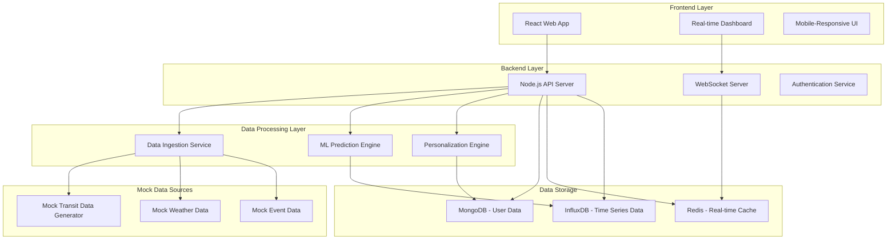
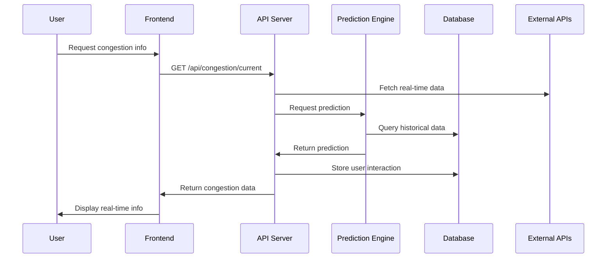

# Design Document

## Overview

개인 맞춤형 혼잡도 예측 알림 서비스는 실시간 데이터 수집, AI 기반 예측, 개인화 추천, 사용자 인터페이스의 4개 주요 컴포넌트로 구성된 웹 애플리케이션입니다. React 기반 프론트엔드와 Node.js 백엔드, 그리고 머신러닝 예측 엔진을 통합하여 사용자에게 실시간 혼잡도 정보와 개인화된 교통 추천을 제공합니다.

**본 프로젝트는 「2025 국민행복증진 철도·대중교통·물류 아이디어 공모전」 출품작으로, 국민의 교통 편의성 향상과 행복 증진을 목표로 개발된 프로토타입입니다.**

## Architecture

### System Architecture



### Data Flow Architecture



## Components and Interfaces

### 1. Frontend Components

#### Main Dashboard Component
- **Purpose**: 실시간 혼잡도 정보와 예측 데이터를 시각화
- **Key Features**:
  - 지도 기반 교통 현황 표시
  - 색상 코드 기반 혼잡도 시각화 (녹색/노란색/빨간색)
  - 실시간 업데이트 (WebSocket 연결)
- **Props**: `userLocation`, `selectedRoute`, `congestionData`

#### Timeline Component
- **Purpose**: SVG 다이어그램에서 보여준 하루 일과별 활용 가이드 구현
- **Key Features**:
  - 7:00am부터 9:00pm까지의 시간대별 추천
  - 개인화된 알림 시점 표시
  - 혼잡도 예측 정보 타임라인
- **Props**: `userSchedule`, `predictions`, `personalizedAlerts`

#### Route Recommendation Component
- **Purpose**: 대체 경로 추천 및 비교
- **Key Features**:
  - 최대 3개 경로 옵션 표시
  - 예상 소요 시간 및 혼잡도 비교
  - 인센티브 정보 표시
- **Props**: `routes`, `currentCongestion`, `incentives`

#### User Profile Component
- **Purpose**: 개인 설정 및 선호도 관리
- **Key Features**:
  - 혼잡도 허용 수준 설정
  - 자주 가는 장소 관리
  - 알림 설정 관리
- **Props**: `userPreferences`, `frequentLocations`

### 2. Backend API Endpoints

#### Congestion Data API
```javascript
// GET /api/congestion/current
// 현재 혼잡도 정보 조회
{
  "location": { "lat": 37.5665, "lng": 126.9780 },
  "radius": 1000,
  "transportTypes": ["subway", "bus"]
}

// GET /api/congestion/prediction
// 혼잡도 예측 정보 조회
{
  "route": "line2-gangnam-to-hongik",
  "timeRange": "1-3hours",
  "date": "2025-01-08"
}
```

#### User Personalization API
```javascript
// POST /api/user/preferences
// 사용자 선호도 설정
{
  "congestionTolerance": "medium",
  "maxWalkingDistance": 800,
  "maxTransfers": 2,
  "preferredDepartureTime": "08:30"
}

// GET /api/user/recommendations
// 개인화된 추천 조회
{
  "userId": "user123",
  "origin": "gangnam-station",
  "destination": "hongik-university",
  "departureTime": "2025-01-08T08:00:00Z"
}
```

#### Feedback API
```javascript
// POST /api/feedback/congestion
// 실제 혼잡도 피드백 제출
{
  "routeId": "line2-car3",
  "actualCongestion": "high",
  "predictedCongestion": "medium",
  "timestamp": "2025-01-08T08:30:00Z",
  "rating": 3
}
```

### 3. Mock Prediction Engine (Prototype)

#### Mock Prediction Service
```javascript
class MockCongestionPredictor {
    predictCongestion(routeId, timeRange, externalFactors) {
        /**
         * 프로토타입용 가상 혼잡도 예측
         * 시간대별 패턴과 랜덤 요소를 조합하여 현실적인 데이터 생성
         */
        return this.generateRealisticPrediction(routeId, timeRange);
    }
    
    generateRealisticPrediction(routeId, timeRange) {
        /**
         * 출퇴근 시간대 패턴을 반영한 가상 데이터 생성
         * - 7-9시, 18-20시: 높은 혼잡도
         * - 11-14시: 중간 혼잡도  
         * - 기타 시간: 낮은 혼잡도
         */
        // 가상 예측 로직 구현
    }
}
```

#### Mock Data Pipeline
- **Mock Data Generation**: 현실적인 패턴을 가진 가상 교통 데이터 생성
- **Pattern Simulation**: 시간대별, 요일별 혼잡 패턴 시뮬레이션
- **Randomization**: 실제와 유사한 변동성을 위한 랜덤 요소 추가
- **Prototype Serving**: 즉시 사용 가능한 예측 결과 제공

## Data Models

### User Model
```javascript
{
  "_id": "ObjectId",
  "email": "user@example.com",
  "preferences": {
    "congestionTolerance": "medium", // low, medium, high
    "maxWalkingDistance": 800, // meters
    "maxTransfers": 2,
    "notificationEnabled": true,
    "notificationTiming": 30 // minutes before departure
  },
  "frequentRoutes": [
    {
      "origin": "gangnam-station",
      "destination": "hongik-university",
      "frequency": 5, // times per week
      "preferredTime": "08:30"
    }
  ],
  "points": 1250,
  "createdAt": "2025-01-08T00:00:00Z",
  "updatedAt": "2025-01-08T00:00:00Z"
}
```

### Congestion Data Model
```javascript
{
  "_id": "ObjectId",
  "routeId": "line2-gangnam-hongik",
  "stationId": "gangnam-station",
  "timestamp": "2025-01-08T08:30:00Z",
  "congestionLevel": "high", // low, medium, high
  "congestionPercentage": 85,
  "passengerCount": 1200,
  "vehicleCapacity": 1400,
  "weatherCondition": "clear",
  "specialEvents": [],
  "source": "realtime-sensor"
}
```

### Prediction Model
```javascript
{
  "_id": "ObjectId",
  "routeId": "line2-gangnam-hongik",
  "predictionTime": "2025-01-08T08:00:00Z",
  "predictions": [
    {
      "time": "2025-01-08T08:30:00Z",
      "congestionLevel": "high",
      "confidence": 0.87
    },
    {
      "time": "2025-01-08T09:00:00Z",
      "congestionLevel": "medium",
      "confidence": 0.92
    }
  ],
  "modelVersion": "v1.2.3",
  "accuracy": 0.89
}
```

### Feedback Model
```javascript
{
  "_id": "ObjectId",
  "userId": "user123",
  "routeId": "line2-car3",
  "timestamp": "2025-01-08T08:30:00Z",
  "predictedCongestion": "medium",
  "actualCongestion": "high",
  "rating": 3, // 1-5 scale
  "comment": "More crowded than expected",
  "verified": true
}
```

## Error Handling

### Frontend Error Handling
- **Network Errors**: 연결 실패 시 캐시된 데이터 표시 및 재시도 메커니즘
- **Data Loading Errors**: 스켈레톤 UI와 에러 메시지 표시
- **Location Errors**: GPS 접근 실패 시 수동 위치 입력 옵션 제공

### Backend Error Handling
- **External API Failures**: 서킷 브레이커 패턴으로 장애 전파 방지
- **Database Errors**: 연결 풀 관리 및 자동 재연결
- **Prediction Errors**: 폴백 모델 사용 및 기본 추천 제공

### Data Quality Assurance
- **Anomaly Detection**: 비정상적인 혼잡도 데이터 필터링
- **Data Validation**: 입력 데이터 검증 및 정제
- **Feedback Verification**: 사용자 피드백 신뢰도 검증

## Testing Strategy

### Unit Testing
- **Frontend**: Jest + React Testing Library
  - 컴포넌트 렌더링 테스트
  - 사용자 상호작용 테스트
  - 상태 관리 테스트

- **Backend**: Jest + Supertest
  - API 엔드포인트 테스트
  - 데이터베이스 연동 테스트
  - 비즈니스 로직 테스트

### Integration Testing
- **API Integration**: 외부 API 연동 테스트
- **Database Integration**: 데이터 저장/조회 테스트
- **WebSocket Integration**: 실시간 통신 테스트

### End-to-End Testing
- **User Journey Testing**: Cypress를 사용한 전체 사용자 플로우 테스트
- **Performance Testing**: 대용량 데이터 처리 성능 테스트
- **Mobile Responsiveness**: 다양한 디바이스에서의 UI/UX 테스트

### Machine Learning Testing
- **Model Accuracy Testing**: 예측 정확도 검증
- **A/B Testing**: 다른 모델 버전 간 성능 비교
- **Bias Testing**: 모델 편향성 검증

## Performance Considerations (Prototype Focus)

### Frontend Optimization
- **Component Optimization**: React.memo와 useMemo를 통한 불필요한 리렌더링 방지
- **Mock Data Caching**: 클라이언트 사이드에서 생성된 가상 데이터 캐싱
- **Responsive Design**: 다양한 디바이스에서 빠른 렌더링

### Backend Optimization (Simplified)
- **In-Memory Storage**: 프로토타입용 간단한 메모리 기반 데이터 저장
- **Mock API Performance**: 빠른 응답을 위한 효율적인 가상 데이터 생성
- **Minimal Dependencies**: 프로토타입에 필요한 최소한의 라이브러리 사용

### Mock Data Processing
- **Efficient Generation**: 실시간 가상 데이터 생성 최적화
- **Pattern Caching**: 자주 사용되는 혼잡 패턴 캐싱
- **Lightweight Updates**: 가벼운 실시간 업데이트 시뮬레이션

## Security Considerations

### Authentication & Authorization
- **JWT Token**: 사용자 인증을 위한 JWT 토큰 사용
- **Role-based Access**: 일반 사용자와 관리자 권한 분리
- **API Rate Limiting**: API 호출 빈도 제한

### Data Protection
- **Personal Data Encryption**: 개인정보 암호화 저장
- **HTTPS**: 모든 통신 암호화
- **Input Validation**: SQL Injection 및 XSS 공격 방지

### Privacy Compliance
- **Data Minimization**: 필요한 최소한의 데이터만 수집
- **User Consent**: 데이터 수집 및 사용에 대한 사용자 동의
- **Data Retention**: 데이터 보관 기간 정책 수립