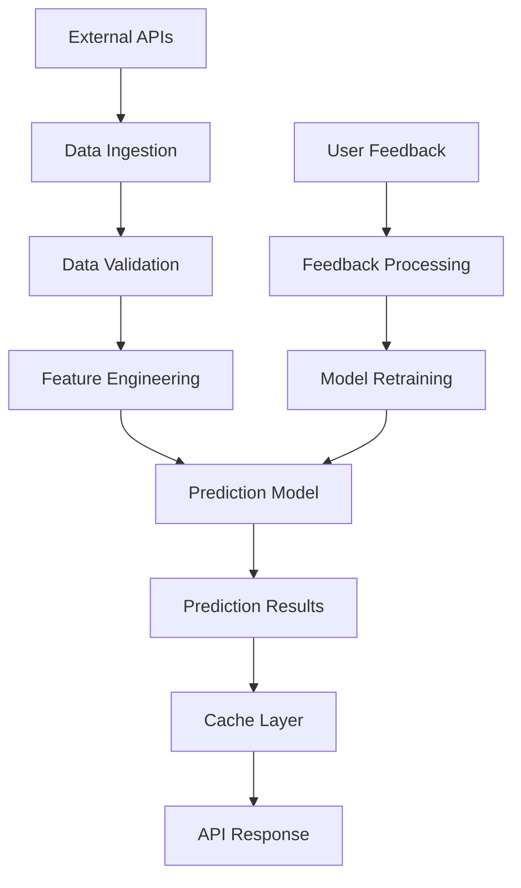
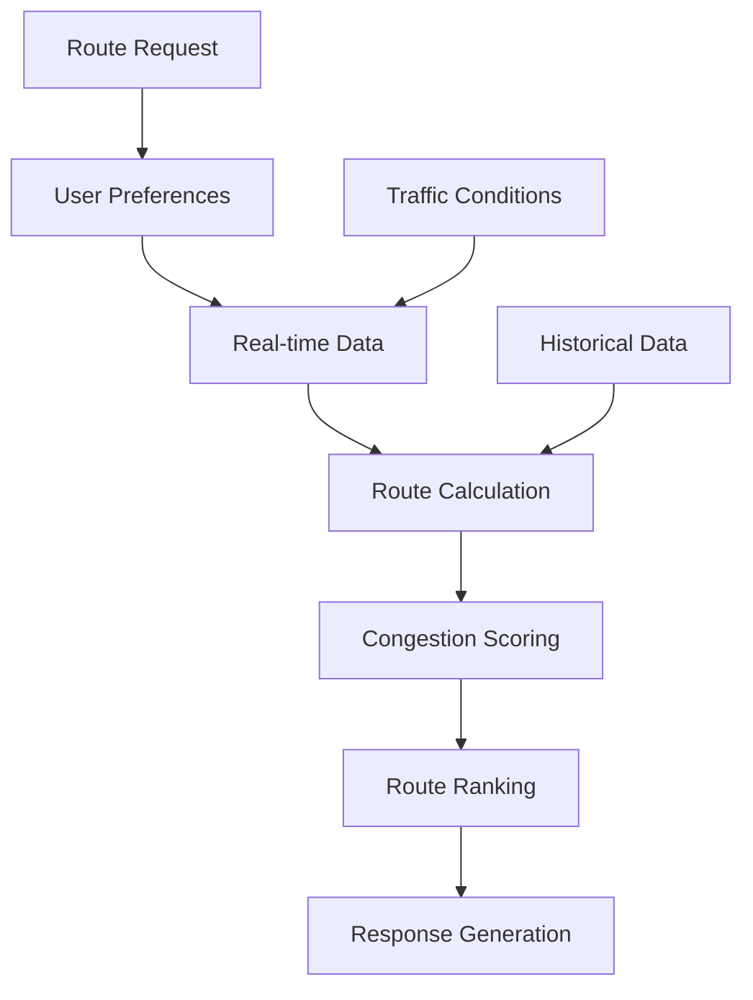

# 🏗️ 시스템 아키텍처

## 📋 개요

혼잡도 예측 서비스의 프로토타입 아키텍처 문서입니다.
실제 서비스 구현을 위한 설계 가이드라인과 현재 프로토타입의 구조를 설명합니다.

## 🎯 아키텍처 원칙

### 1. 확장성 (Scalability)
- 마이크로서비스 아키텍처 지향
- 수평적 확장 가능한 구조
- 클라우드 네이티브 설계

### 2. 신뢰성 (Reliability)
- 장애 격리 및 복구 메커니즘
- 데이터 일관성 보장
- 실시간 모니터링

### 3. 성능 (Performance)
- 캐싱 전략 적용
- 비동기 처리 최적화
- CDN 활용

### 4. 보안 (Security)
- 다층 보안 구조
- 데이터 암호화
- 접근 권한 관리

## 🏛️ 전체 시스템 구조

```
┌─────────────────────────────────────────────────────────────┐
│                        Client Layer                         │
├─────────────────────────────────────────────────────────────┤
│  Web App (React)  │  Mobile App  │  Admin Dashboard        │
└─────────────────────────────────────────────────────────────┘
                              │
┌─────────────────────────────────────────────────────────────┐
│                      API Gateway                            │
├─────────────────────────────────────────────────────────────┤
│  • Authentication  • Rate Limiting  • Load Balancing       │
│  • Request Routing • Response Caching • API Versioning     │
└─────────────────────────────────────────────────────────────┘
                              │
┌─────────────────────────────────────────────────────────────┐
│                   Microservices Layer                       │
├─────────────────────────────────────────────────────────────┤
│  Auth Service  │  Prediction  │  Route Service │  User      │
│               │  Service     │               │  Service   │
│  Notification │  Feedback    │  Analytics    │  Admin     │
│  Service      │  Service     │  Service      │  Service   │
└─────────────────────────────────────────────────────────────┘
                              │
┌─────────────────────────────────────────────────────────────┐
│                     Data Layer                              │
├─────────────────────────────────────────────────────────────┤
│  PostgreSQL  │  Redis Cache │  InfluxDB     │  MongoDB     │
│  (User Data) │  (Sessions)  │  (Time Series)│  (Logs)      │
└─────────────────────────────────────────────────────────────┘
                              │
┌─────────────────────────────────────────────────────────────┐
│                 External Data Sources                       │
├─────────────────────────────────────────────────────────────┤
│  Seoul Metro API │  Bus API  │  Weather API │  Event API   │
└─────────────────────────────────────────────────────────────┘
```

## 🔧 프로토타입 구조

### Frontend (React Application)

```
frontend/
├── src/
│   ├── components/          # 재사용 가능한 컴포넌트
│   │   ├── auth/           # 인증 관련 컴포넌트
│   │   ├── common/         # 공통 컴포넌트
│   │   ├── congestion/     # 혼잡도 관련 컴포넌트
│   │   ├── routes/         # 경로 관련 컴포넌트
│   │   ├── schedule/       # 일정 관련 컴포넌트
│   │   ├── feedback/       # 피드백 관련 컴포넌트
│   │   ├── admin/          # 관리자 컴포넌트
│   │   └── mobile/         # 모바일 최적화 컴포넌트
│   ├── pages/              # 페이지 컴포넌트
│   ├── contexts/           # React Context (상태 관리)
│   ├── hooks/              # 커스텀 훅
│   ├── services/           # API 서비스 레이어
│   ├── utils/              # 유틸리티 함수
│   ├── types/              # TypeScript 타입 정의
│   └── __tests__/          # 테스트 파일
├── public/                 # 정적 파일
└── dist/                   # 빌드 결과물
```

### Backend (Mock API Server)

```
backend/
├── src/
│   ├── routes/             # API 라우트 정의
│   │   ├── auth.ts         # 인증 API
│   │   ├── congestion.ts   # 혼잡도 API
│   │   ├── routes.ts       # 경로 API
│   │   ├── user.ts         # 사용자 API
│   │   ├── feedback.ts     # 피드백 API
│   │   └── admin.ts        # 관리자 API
│   ├── services/           # 비즈니스 로직
│   │   ├── predictionEngine.ts      # 예측 엔진
│   │   ├── routeRecommendation.ts   # 경로 추천
│   │   ├── congestionGenerator.ts   # 혼잡도 생성
│   │   ├── feedbackProcessor.ts     # 피드백 처리
│   │   └── notificationService.ts   # 알림 서비스
│   ├── data/               # Mock 데이터
│   ├── middleware/         # Express 미들웨어
│   ├── utils/              # 유틸리티 함수
│   └── types/              # TypeScript 타입 정의
└── dist/                   # 컴파일된 JavaScript
```

## 🧠 핵심 서비스 상세

### 1. 예측 엔진 (Prediction Engine)

```typescript
interface PredictionEngine {
  // 혼잡도 예측
  predictCongestion(
    station: string,
    time: Date,
    factors: PredictionFactors
  ): Promise<CongestionPrediction>;
  
  // 모델 학습
  trainModel(
    historicalData: HistoricalData[],
    feedbackData: FeedbackData[]
  ): Promise<ModelMetrics>;
  
  // 정확도 평가
  evaluateAccuracy(
    predictions: Prediction[],
    actualData: ActualData[]
  ): AccuracyMetrics;
}
```

**구현 특징:**
- 시간 시리즈 분석 기반 예측
- 날씨, 이벤트, 요일 등 외부 요인 고려
- 사용자 피드백을 통한 지속적 학습
- 실시간 모델 업데이트

### 2. 경로 추천 시스템 (Route Recommendation)

```typescript
interface RouteRecommendationService {
  // 최적 경로 검색
  findOptimalRoutes(
    origin: Location,
    destination: Location,
    preferences: UserPreferences,
    constraints: RouteConstraints
  ): Promise<Route[]>;
  
  // 실시간 경로 업데이트
  updateRouteWithRealTimeData(
    route: Route,
    realTimeData: RealTimeData
  ): Promise<Route>;
}
```

**알고리즘:**
- A* 알고리즘 기반 최단 경로 탐색
- 혼잡도 가중치 적용
- 다중 목적 최적화 (시간, 혼잡도, 비용)
- 개인화된 선호도 반영

### 3. 실시간 데이터 처리

```typescript
interface RealTimeProcessor {
  // 데이터 스트림 처리
  processDataStream(
    stream: DataStream,
    processors: StreamProcessor[]
  ): ProcessedData;
  
  // 이벤트 발행
  publishEvent(
    event: SystemEvent,
    subscribers: Subscriber[]
  ): void;
}
```

**기술 스택:**
- WebSocket을 통한 실시간 통신
- Server-Sent Events (SSE) 지원
- Redis Pub/Sub 패턴
- 이벤트 기반 아키텍처

## 💾 데이터 모델

### 1. 사용자 데이터

```sql
-- Users Table
CREATE TABLE users (
    id UUID PRIMARY KEY,
    email VARCHAR(255) UNIQUE NOT NULL,
    name VARCHAR(100) NOT NULL,
    password_hash VARCHAR(255) NOT NULL,
    points INTEGER DEFAULT 0,
    level VARCHAR(20) DEFAULT 'Bronze',
    created_at TIMESTAMP DEFAULT NOW(),
    updated_at TIMESTAMP DEFAULT NOW()
);

-- User Preferences
CREATE TABLE user_preferences (
    user_id UUID REFERENCES users(id),
    congestion_tolerance VARCHAR(10),
    max_walking_distance INTEGER,
    max_transfers INTEGER,
    notification_enabled BOOLEAN DEFAULT true,
    preferred_modes TEXT[],
    updated_at TIMESTAMP DEFAULT NOW()
);
```

### 2. 혼잡도 데이터

```sql
-- Congestion Data (Time Series)
CREATE TABLE congestion_data (
    id UUID PRIMARY KEY,
    station_id VARCHAR(50) NOT NULL,
    line VARCHAR(20) NOT NULL,
    congestion_level VARCHAR(10) NOT NULL,
    congestion_percentage INTEGER NOT NULL,
    passenger_count INTEGER,
    timestamp TIMESTAMP NOT NULL,
    data_source VARCHAR(20) NOT NULL
);

-- Predictions
CREATE TABLE predictions (
    id UUID PRIMARY KEY,
    station_id VARCHAR(50) NOT NULL,
    predicted_time TIMESTAMP NOT NULL,
    predicted_congestion INTEGER NOT NULL,
    confidence_score DECIMAL(3,2),
    model_version VARCHAR(10),
    created_at TIMESTAMP DEFAULT NOW()
);
```

### 3. 경로 및 일정 데이터

```sql
-- Routes
CREATE TABLE routes (
    id UUID PRIMARY KEY,
    user_id UUID REFERENCES users(id),
    name VARCHAR(100),
    origin VARCHAR(100) NOT NULL,
    destination VARCHAR(100) NOT NULL,
    route_data JSONB NOT NULL,
    is_favorite BOOLEAN DEFAULT false,
    usage_count INTEGER DEFAULT 0,
    created_at TIMESTAMP DEFAULT NOW()
);

-- Schedules
CREATE TABLE schedules (
    id UUID PRIMARY KEY,
    user_id UUID REFERENCES users(id),
    title VARCHAR(200) NOT NULL,
    location VARCHAR(100) NOT NULL,
    start_time TIMESTAMP NOT NULL,
    end_time TIMESTAMP NOT NULL,
    route_id UUID REFERENCES routes(id),
    notification_time INTEGER, -- minutes before
    created_at TIMESTAMP DEFAULT NOW()
);
```

## 🔄 데이터 플로우

### 1. 혼잡도 예측 플로우



### 2. 경로 추천 플로우



## 🚀 배포 아키텍처

### 프로덕션 환경

```yaml
# Kubernetes Deployment Example
apiVersion: apps/v1
kind: Deployment
metadata:
  name: congestion-api
spec:
  replicas: 3
  selector:
    matchLabels:
      app: congestion-api
  template:
    metadata:
      labels:
        app: congestion-api
    spec:
      containers:
      - name: api
        image: congestion-api:latest
        ports:
        - containerPort: 3000
        env:
        - name: DATABASE_URL
          valueFrom:
            secretKeyRef:
              name: db-secret
              key: url
        resources:
          requests:
            memory: "256Mi"
            cpu: "250m"
          limits:
            memory: "512Mi"
            cpu: "500m"
```

### 모니터링 및 로깅

```yaml
# Monitoring Stack
services:
  - Prometheus: 메트릭 수집
  - Grafana: 시각화 대시보드
  - ELK Stack: 로그 분석
  - Jaeger: 분산 추적
  - AlertManager: 알림 관리
```

## 🔒 보안 아키텍처

### 1. 인증 및 권한 관리

```typescript
interface SecurityLayer {
  // JWT 기반 인증
  authenticateUser(token: string): Promise<User>;
  
  // 역할 기반 접근 제어
  authorizeAccess(
    user: User,
    resource: string,
    action: string
  ): boolean;
  
  // API 요청 제한
  rateLimitCheck(
    userId: string,
    endpoint: string
  ): Promise<boolean>;
}
```

### 2. 데이터 보호

- **암호화**: AES-256 데이터 암호화
- **HTTPS**: 모든 통신 SSL/TLS 적용
- **개인정보 보호**: GDPR 준수 데이터 처리
- **접근 로그**: 모든 데이터 접근 기록

## 📊 성능 최적화

### 1. 캐싱 전략

```typescript
interface CacheStrategy {
  // 다층 캐싱
  L1: 'Application Memory Cache',
  L2: 'Redis Distributed Cache',
  L3: 'CDN Edge Cache',
  
  // 캐시 정책
  policies: {
    congestionData: '5 minutes',
    routeData: '15 minutes',
    userPreferences: '1 hour',
    staticContent: '24 hours'
  }
}
```

### 2. 데이터베이스 최적화

- **인덱싱**: 쿼리 성능 최적화
- **파티셔닝**: 대용량 데이터 분할 저장
- **읽기 복제본**: 읽기 성능 향상
- **연결 풀링**: 데이터베이스 연결 관리

## 🔮 확장 계획

### 1. 기능 확장

- **AI/ML 고도화**: 딥러닝 모델 적용
- **다중 교통수단**: 버스, 지하철, 택시 통합
- **개인화 강화**: 사용자 행동 패턴 학습
- **예측 정확도 향상**: 더 많은 데이터 소스 활용

### 2. 기술 확장

- **마이크로서비스**: 서비스 분리 및 독립 배포
- **서버리스**: AWS Lambda, Azure Functions 활용
- **엣지 컴퓨팅**: 지연 시간 최소화
- **블록체인**: 데이터 무결성 보장

---

**참고**: 현재 프로토타입은 단순화된 구조로 구현되었으며, 실제 서비스에서는 위의 아키텍처를 기반으로 단계적 확장이 필요합니다.